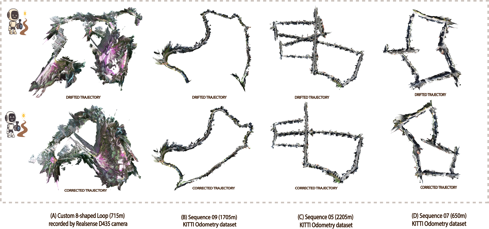

<div align="center">
  <h1>VGGT-SLAM++</h1>
  <p>
    <a href="https://arxiv.org/abs/2604.06830"></a>
    &nbsp;
    
  </p>
  <p><em>A complete visual SLAM system that stabilises VGGT odometry with a DEM-based, high-cadence Sim(3) back-end.</em></p>
  <p align="center"></p>
  <p>
    <a href="https://arxiv.org/abs/2604.06830"><strong>Avilasha Mandal</strong></a><sup>1</sup>
    · Rajesh Kumar<sup>2</sup>
    · Sudarshan Sunil Harithas<sup>3</sup>
    · Chetan Arora<sup>1</sup>
  </p>
  <p><sup>1</sup>Indian Institute of Technology Delhi &nbsp; <sup>2</sup>Addverb Technologies &nbsp; <sup>3</sup>Brown University</p>
</div>

---

This repository is the public release of **VGGT-SLAM++** ([arXiv:2604.06830](https://arxiv.org/abs/2604.06830), CVPRW 2026). The front-end is derived from [VGGT-SLAM](https://github.com/MIT-SPARK/VGGT-SLAM) (Maggio, Lim, Carlone); the DEM covisibility graph, DINOv2 tile embeddings, AnyLoc VPR, and Sim(3) spatially corrective back-end are ours.

Off-the-shelf checkpoints (**VGGT-1B**, **DINOv2**) are **not** vendored here; `setup.sh` / `torch.hub` download them. This repo has no trained VGGT-SLAM++ weights of its own.

## Method (paper Sec. 3, Fig. 3)

1. **Front-end.** Keyframes are selected with Lucas–Kanade disparity (`τ_disparity = 40`). Each submap has `w = 32` frames and inherits one transition frame `M_prior`. We set `w_loops = 0` so loop closure is **not** injected into VGGT. VGGT reconstructs depth, cameras, and point maps. Adjacent submaps are aligned with a Sim(3) motion-only solver. Far-field floaters are removed by depth thresholding (App. A2).
2. **DEM-augmented map.** All aligned points are fit to a global plane (RANSAC + SVD), rasterised at a fixed metres-per-pixel, and aggregated with a **softmax** height reducer (default `τ = 0.02`). The DEM is patched into **2 m × 2 m** tiles / query chips.
3. **Structure-aware embeddings (Eq. 1).** Each global tile `τ_k` is encoded with DINOv2. Tokens in a **9×9** neighbourhood are pooled with a Gaussian positional weight `w_j` and a gradient-based visibility mask `m_j`. Query chips use the same encoder over the whole submap.
4. **FAISS-HNSW covisibility (Eq. 2–3).** Cosine similarity retrieves neighbour tiles; scores vote to parent submaps. Top-`K = 10` submaps become covisible neighbours.
5. **AnyLoc VPR.** Inside that covisibility window, AnyLoc-style VLAD-on-DINOv2 matches query chips to gallery tiles and writes submap–submap loop edges.
6. **Spatially corrective back-end (Eq. 4).** Loop edges are optimised on `Sim(3)` by minimising the weighted geodesic error (Gauss–Newton / Levenberg–Marquardt). This runs at high cadence (~1.89 FPS) alongside the ~16 FPS front-end.

Code map:

| Paper | Code |
| --- | --- |
| Front-end, `w`, `τ_disparity`, `w_loops = 0` | `main.py`, `vggt_slam/solver.py`, `vggt_slam/frame_overlap.py` |
| Sim(3) graph, Eq. (4) | `vggt_slam/graph_sim3.py` |
| Depth floaters, App. A2 | `Solver.add_points` depth mask |
| Global DEM, App. A3 | `vggt_slam/global_dem_tiled.py` |
| 9×9 DINOv2 pooling, Eq. (1) | `vggt_slam/tools/embed_global_tiles.py` |
| FAISS-HNSW + voting, Eq. (2)–(3) | `vggt_slam/tools/faiss_global_index.py`, `submap_faiss_vote.py` |
| AnyLoc on DEM | `vggt_slam/tools/run_vpr_retrieval.py`, `prepare_anyloc_io.py` |
| Apply loop edges | `vggt_slam/anyloc_csv.py`, `--external_loops_csv` |

Hyperparameters live in [`configs/default.yaml`](configs/default.yaml).

## Installation

```bash
sudo apt-get install git python3-pip libboost-all-dev cmake gcc g++ unzip
conda create -n vggt-slam-pp python=3.11
conda activate vggt-slam-pp
chmod +x setup.sh && ./setup.sh
```

VGGT is cloned from [facebookresearch/vggt](https://github.com/facebookresearch/vggt). DINOv2 is loaded with `torch.hub.load('facebookresearch/dinov2', 'dinov2_vitb14')` on first embedding call.

## Quick start

Front-end (VGGT + Sim(3) odometry + tiled DEM):

```bash
python main.py \
  --image_folder /path/to/rgb \
  --use_sim3 \
  --max_loops 0 \
  --submap_size 32 \
  --min_disparity 40 \
  --make_global_dem_tiled \
  --dump_submaps \
  --global_dem_out_dir outputs/run \
  --global_reducer softmax \
  --global_softmax_tau 0.02 \
  --log_results --skip_dense_log \
  --log_path outputs/run/poses.txt
```

Back-end (DEM embeddings, FAISS-HNSW, optional AnyLoc VPR):

```bash
python scripts/run_backend.py --root outputs/run --with-vpr
```

Then re-apply loop edges and write the corrected trajectory:

```bash
python main.py \
  --image_folder /path/to/rgb \
  --use_sim3 --max_loops 0 \
  --external_loops_csv outputs/run/anyloc_io/loop_votes.csv \
  --log_results --skip_dense_log \
  --log_path outputs/run/poses_corrected.txt
```

Or keep the back-end watcher running while the front-end dumps submaps:

```bash
python backend_watch.py --root outputs/run --with-embeddings
```

## Results

Compact trajectories, DEM mosaics, and paper tables are under [`results/`](results/). Representative numbers from the paper (uncalibrated RGB, ATE RMSE, metres):

**KITTI Odometry (Table 1)** — VGGT-SLAM++ avg **64.94** vs VGGT-SLAM Sim(3) **81.22**.

**TUM RGB-D (Table 2)** — VGGT-SLAM++ avg **0.036** vs VGGT-SLAM SL(4) **0.053** / Sim(3) **0.079**.

**7-Scenes (Table 3)** — VGGT-SLAM++ avg **0.064**.

**Virtual KITTI (Table 4)** — strong across weather variants; see `results/tables/`.

Overall, vs the VGGT-SLAM Sim(3)+SL(4) per-dataset average, VGGT-SLAM++ reduces ATE by **18.6%**. DEM ablations (Table 5) are in `results/tables/kitti_dem_ablation.md`.

Front-end ~16 FPS, back-end ~1.89 FPS, ~8 GB RAM / ~20 GB VRAM on an RTX 4090 (paper Sec. 4).

## What is not in this repo

- Off-the-shelf **VGGT-1B** and **DINOv2** weights (downloaded at runtime).
- Raw submap point clouds / full DEM `.npy` tiles (terabytes). Mosaics and pose files are included.
- Experimental / non-paper code (SL(4) graphs, FinderNet-style DEM nets, hardcoded machine paths). That stays in the internal scratch workspace.

## Citation

```bibtex
@inproceedings{mandal2026vggtslampp,
  title     = {{VGGT-SLAM}++},
  author    = {Mandal, Avilasha and Kumar, Rajesh and Harithas, Sudarshan Sunil and Arora, Chetan},
  booktitle = {CVPR Workshops},
  year      = {2026},
  note      = {arXiv:2604.06830}
}
```

Please also cite [VGGT](https://arxiv.org/abs/2503.11651) and [VGGT-SLAM](https://arxiv.org/abs/2505.12549) when using the front-end.

## Acknowledgements

We thank Aryan Singh for assistance with some of the experiments. This research was conducted in collaboration with Addverb Technologies and IHFC. The Sim(3) front-end structure follows VGGT-SLAM (MIT-SPARK).
